[](https://infrati.dev)

### Módulo do terraform para executar o Atlantis no AWS Fargate

```
https://registry.terraform.io/modules/terraform-aws-modules/atlantis/aws/latest
```

### Atlantis

Atlantis é uma ferramenta para automatizar o terraform por meio de pull requests. 
O Atlantis ouve o webhook do GitHub e retorna o output dos comandos ```terraform plan``` e ```terraform apply``` através dos comentários.

### Requirements

* Será utilizado o módulo abaixo para provisionar a infraestrutura do Atlantis no AWS Fargate.

``` 
https://registry.terraform.io/modules/terraform-aws-modules/atlantis/aws/latest 
```

* Terraform instalado, nesse caso utilizado v1.3.2
* Credenciais de acesso já criadas no IAM com as permissões necessárias para os recursos na AWS. A documentação discrimina os recursos utilizados:
~~~
    - Virtual Private Cloud (VPC)
    - SSL certificate using Amazon Certificate Manager (ACM)
    - Application Load Balancer (ALB)
    - Domain name using AWS Route53 which points to ALB
    - AWS Elastic Container Service (ECS) and AWS Fargate running Atlantis Docker image
    - AWS Parameter Store to keep secrets and access them in ECS task natively
~~~

* aws_access_key_id e aws_secret_access_key geradas.
* Geração do token no github com permissão ao respositório. Instruções abaixo:

```
https://docs.github.com/en/authentication/keeping-your-account-and-data-secure/creating-a-personal-access-token
```

* Hosted zone criada no AWS Route 53, nesse exemplo vou utilizar o domínio de teste pessoal ```sres.dev```

- Para maiores informações dos recursos e funcionamento: [Github Atlantis](https://github.com/terraform-aws-modules/terraform-aws-atlantis)

### Repositório

#### Estrutura a ser provisionada no PR utilizando Atlantis

```
.
└── terraform-atlantis-aws/
    ├── ec2.tf
    ├── ig.tf
    ├── sg.tf
    ├── subnet-route.tf
    ├── provider.tf
    ├── vpc.tf
    ├── output.tf
    └── variables.tf
```    

#### Estrutura a ser provisionada para deploy do Atlantis

```
.
└── terraform-atlantis-aws/
    └── infra-deploy-atlantis/
        ├── atlantis.tf
        ├── provider.tf
        ├── dynamo-tfstate-lock.tf
        ├── s3-tfstate.tf
        ├── terraform.tfvar
        └── variables.tf
```

### Sequência das execuções

#### Deploy da infraestrutura para o Atlantis on AWS Fargate

Hosted Zone criada no Route 53

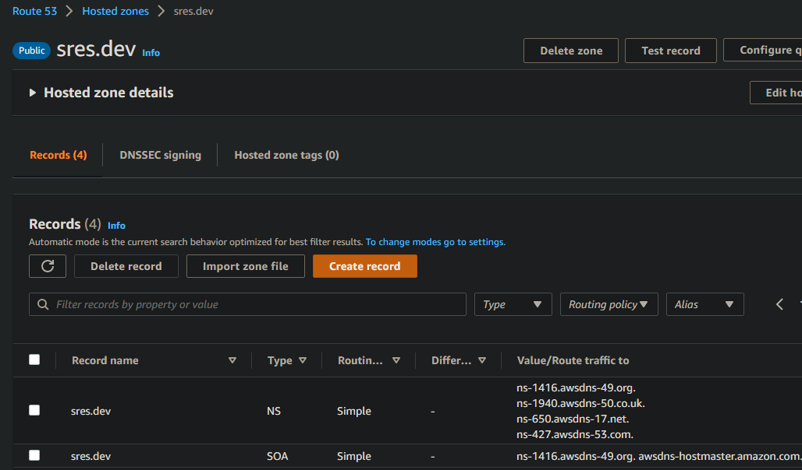

Execução do ```plan``` e ```apply``` para deploy do atlantis

```terraform plan -out tfplan```

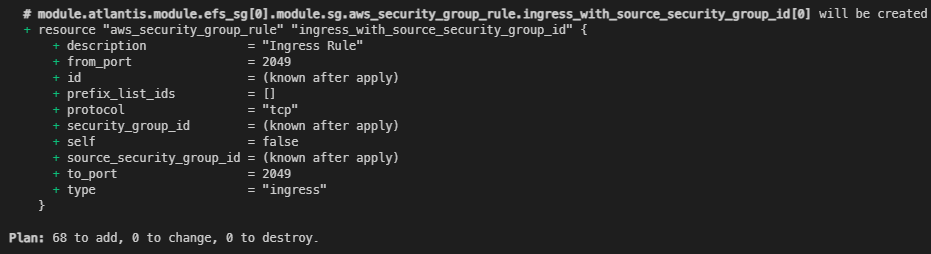

```terraform apply tfplan```

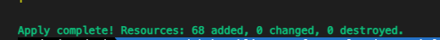

Infraestrutura do Atlantis criada.

Durante o provisionamento dos recursos, o subdomínio ```atlantis.sres.dev``` é criado e direcionado para o ALB.

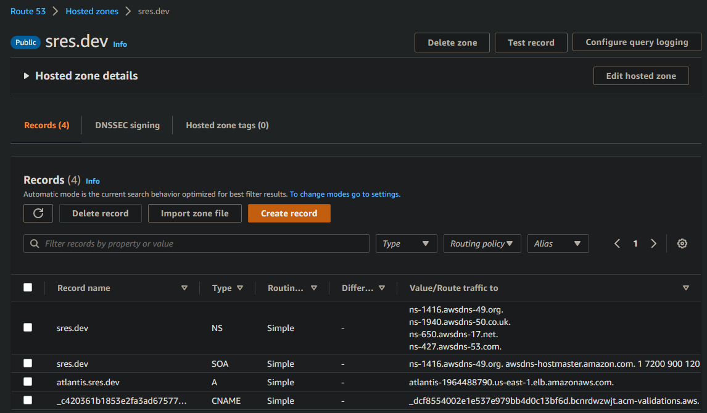

Nesse exemplo será provisionado no pull resquest um servidor web com sistema operacional debian, utilizando ```user_data``` para instalação do apache e alteração da página inicial na inicialização. Exemplo simples para demonstrar o funcionamento da ferramenta.

- Criação de uma nova branch, nesse exemplo ```feat/deploy-ec2-webserver``` com a infraestrutura a ser provisionada. 
- Essa estrutura utiliza remote state com ```S3``` e ```DynamoDB``` para locking, recursos criados juntamente com a infra do atlantis.

Abertura do pull request através da branch criada com a infra a ser provisionada.

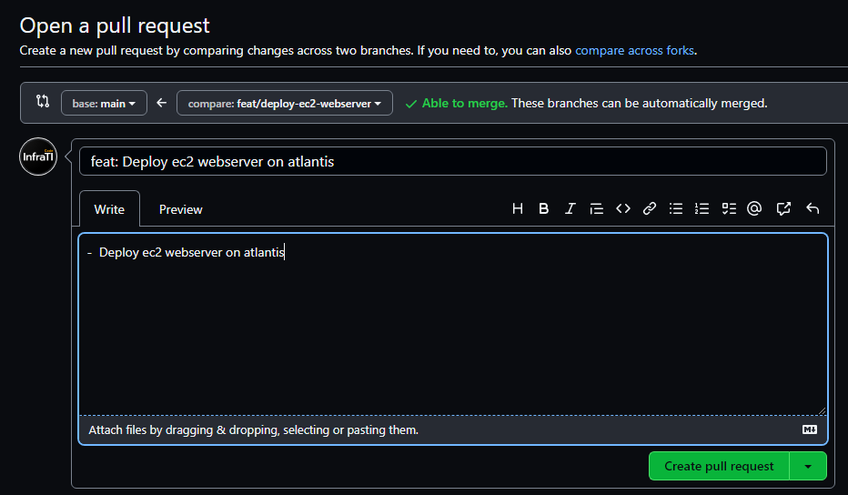

Pull request criado, Atlantis inicia o ```plan``` da infraestrutura

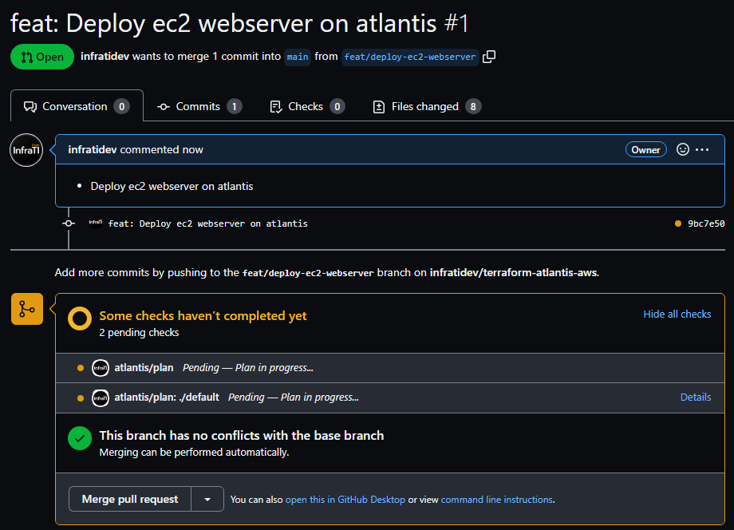

Retorno do output do comando ```terraform plan``` no comentário.

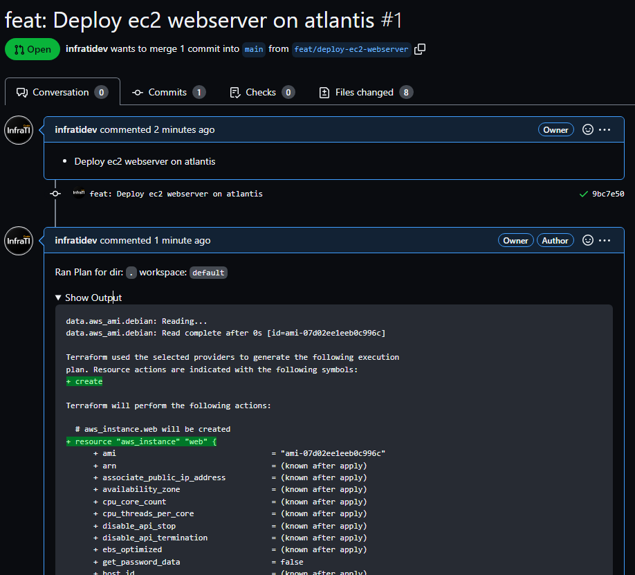

É possível acompanhar a execução através do endpoint ```https://atlantis.sres.dev/jobs/{{hash}} ``` gerado no momento da execução 

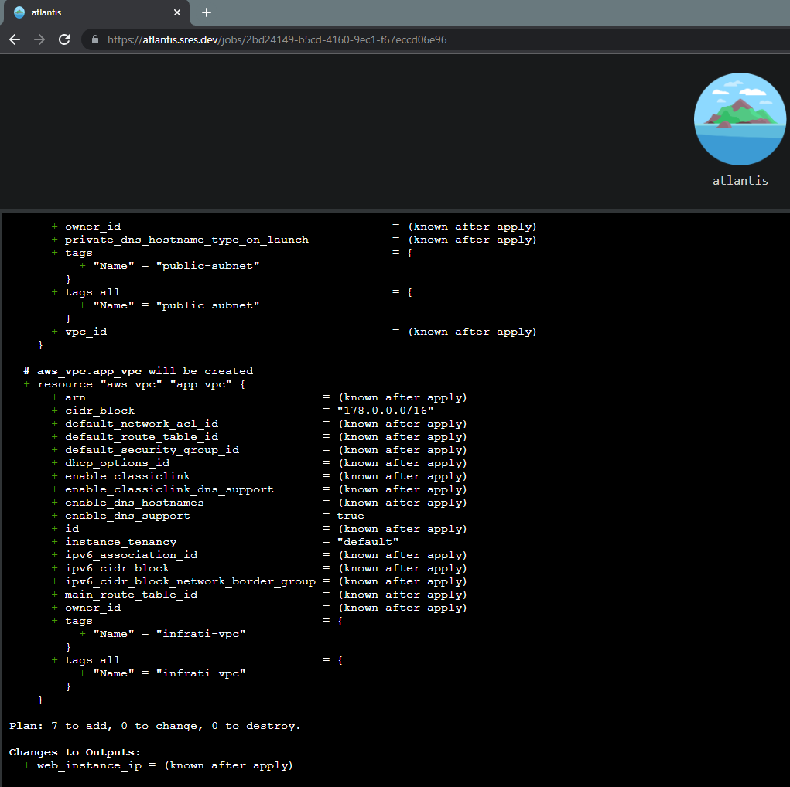

Abaixo mostra o retorno bem sucedido da execução do ```plan``` e no comentário a instrução para execução do apply: ```atlantis apply -d .```

Nesse exemplo de teste, estamos executando o plan no diretório raiz do repositório com workspace `default`, ```-d .```

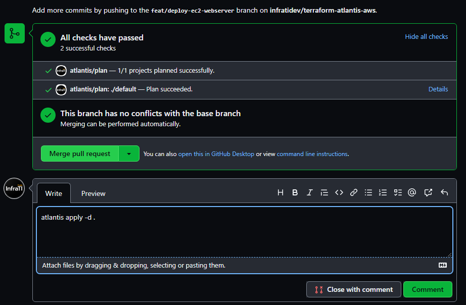

Ao comentar com a instrução do comando, o ```apply ``` entra em execução

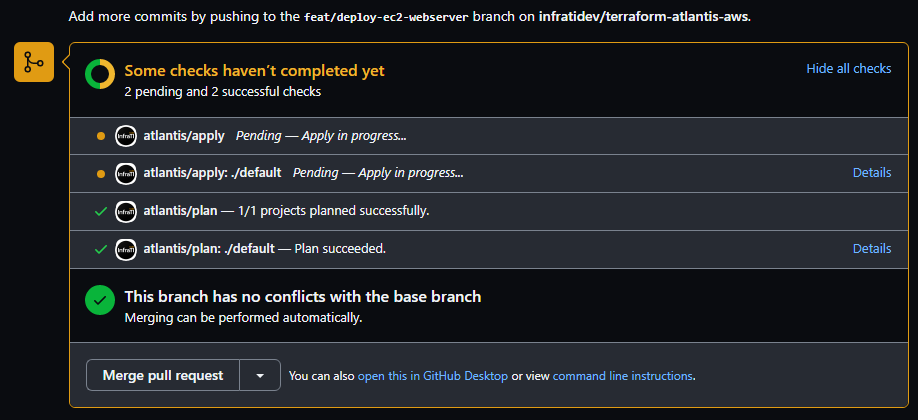

Output do ```apply``` gerado no comentário do PR

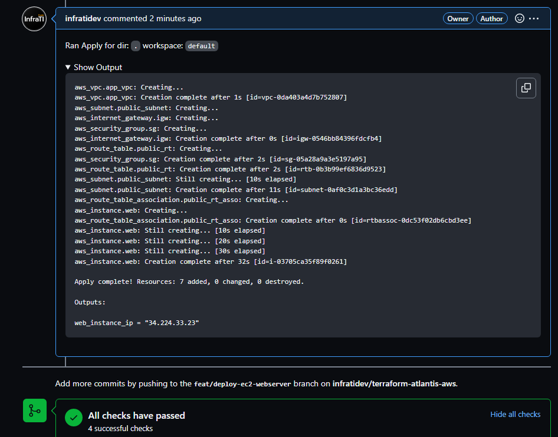

Podemos acompanhar a execução de todo o deploy através do endpoint, assim como no ```plan```

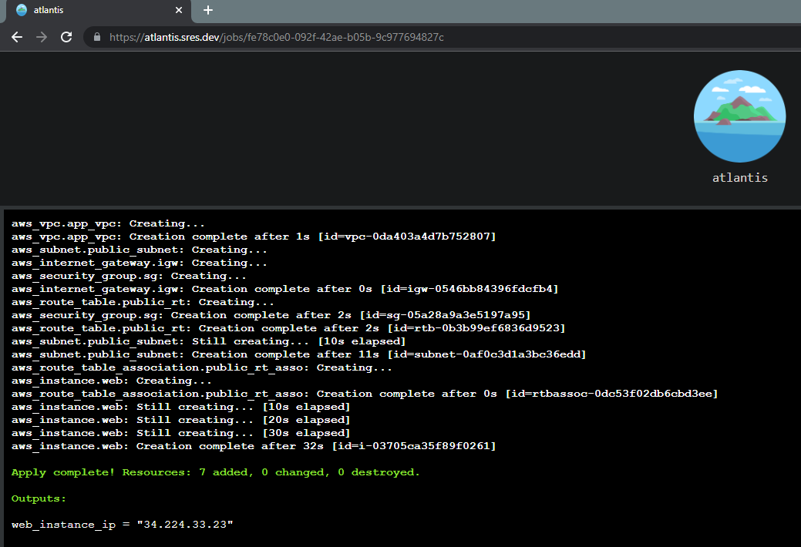

Execução bem sucedida em todas as etapas

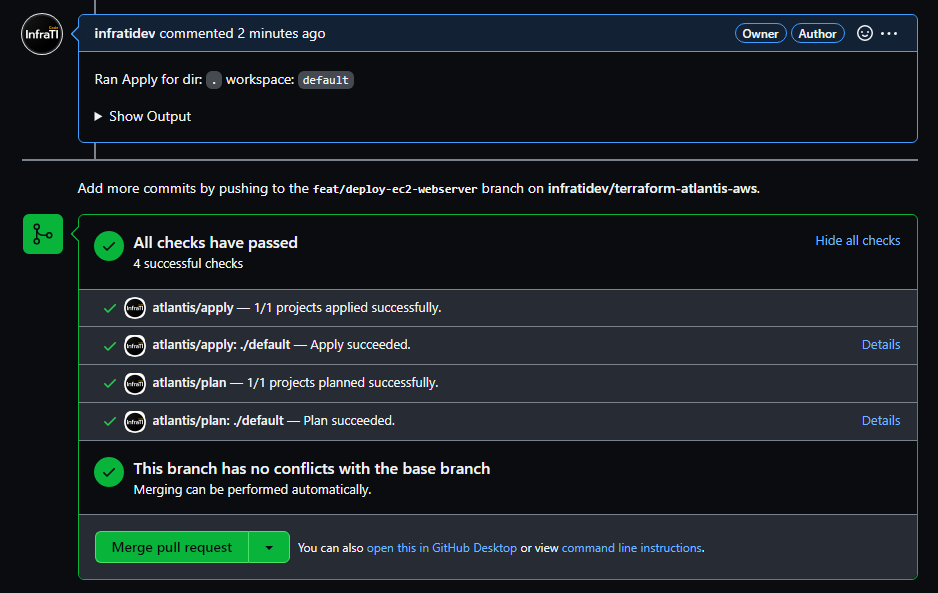

Recurso provisionado com sucesso e disponível para acesso.

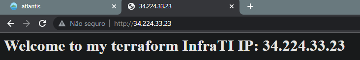

E por fim, merge realizado na ```main```

<br>

[](https://infrati.dev)


